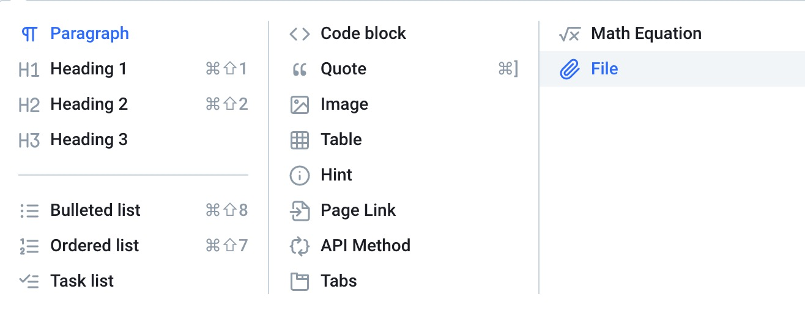

# Use Cases

To insert paragraph, code, equation, image, downloadable file, etc, click on the + mark in between cells. 





To leave a comment, click on the + button to the right of a cell. 


The following **equations** are written in **markdown**

$$
\begin{align}
\dot{x} & = \sigma(y-x) \\
\dot{y} & = \rho x - y - xz \\
\dot{z} & = -\beta z + xy
\end{align}
$$

You can insert code blocks with tags specifying the file name and where it should be executed.




```python
class Seq2SeqAttentionDecoder(d2l.Decoder):
    def __init__(self, vocab_size, embed_size, num_hiddens, num_layers,
                 dropout=0, **kwargs):
        super(Seq2SeqAttentionDecoder, self).__init__(**kwargs)
        self.attention_cell = d2l.MLPAttention(num_hiddens, dropout)
        self.embedding = nn.Embedding(vocab_size, embed_size)
        self.rnn = rnn.LSTM(num_hiddens, num_layers, dropout=dropout)
        self.dense = nn.Dense(vocab_size, flatten=False)

    def init_state(self, enc_outputs, enc_valid_len, *args):
        outputs, hidden_state = enc_outputs
        # Transpose outputs to (batch_size, seq_len, hidden_size)
        return (outputs.swapaxes(0,1), hidden_state, enc_valid_len)

    def forward(self, X, state):
        enc_outputs, hidden_state, enc_valid_len = state
        X = self.embedding(X).swapaxes(0, 1)
        outputs = []
        for x in X:
            # query shape: (batch_size, 1, hidden_size)
            query = hidden_state[0][-1].expand_dims(axis=1)
            # context has same shape as query
            context = self.attention_cell(
                query, enc_outputs, enc_outputs, enc_valid_len)
            # concatenate on the feature dimension
            x = nd.concat(context, x.expand_dims(axis=1), dim=-1)
            # reshape x to (1, batch_size, embed_size+hidden_size)
            out, hidden_state = self.rnn(x.swapaxes(0, 1), hidden_state)
            outputs.append(out)
        outputs = self.dense(nd.concat(*outputs, dim=0))
        return outputs.swapaxes(0, 1), [enc_outputs, hidden_state,
                                        enc_valid_len]
```




You can upload downloadable file.  
Click on the cell below to download our sample prediction data. 






Hit: Insert hint here. 


| col1 | col2 |
| :---: | :---: |
| 1 | a |
| 2 | b |

> You can insert a quote here. 
>
> “I do not fear computers. I fear lack of them.”  
> _— Isaac Asimov_

